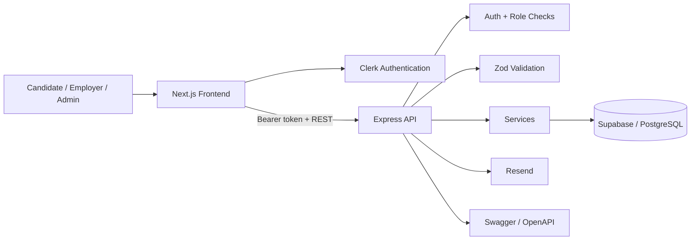

# Rookie

[](https://github.com/itsherhere/Rookie/actions/workflows/ci.yml)


**Rookie** is a full-stack HR and recruitment SaaS portfolio project for startup teams. It combines a public hiring experience with role-based candidate, employer, and admin workspaces for recruitment and day-to-day HR operations.

## Highlights

- Multi-role authentication and authorization with Clerk
- Candidate and employer dashboards
- Job publishing and application tracking
- Hiring pipeline and interview scheduling
- Employee, attendance, leave, and payroll management
- Transparent skill-based job matching
- REST API with validation, rate limiting, and Swagger/OpenAPI docs
- PostgreSQL data model through Supabase
- Automated CI for frontend/backend TypeScript checks and backend builds

## Product areas

| Area | Capabilities |
| --- | --- |
| Candidate | Profile, jobs, applications, interviews, messages, match scores |
| Employer | Company setup, jobs, applicants, interviews, employees, attendance, leave, payroll |
| Admin | User, company, job, and application management |

## Tech stack

**Frontend:** Next.js 14, React 18, TypeScript, Tailwind CSS, Clerk, Radix UI / shadcn, GSAP

**Backend:** Node.js, Express, TypeScript, Zod, Swagger/OpenAPI, Clerk token verification, Express rate limiting, Resend

**Data:** PostgreSQL, Supabase

## Architecture



Repository layout:

```text
Rookie/
├── frontend/        Next.js application
├── backend/         Express REST API
├── supabase/        database and seed resources
├── .github/         CI workflow
└── DEMO_SEEDING.md  portfolio demo-data guide
```

## Skill-based matching

Rookie includes a custom matching service that compares the skills required by a job with a candidate's skills.

It returns:

- match percentage
- matched skills
- missing skills
- a readable fit label

The implementation is intentionally transparent rather than presented as an AI model.

## Backend safeguards

The API includes:

- Clerk Bearer-token verification
- role-based authorization
- Zod request validation
- CORS restrictions
- rate limiting
- centralized error handling
- Swagger / OpenAPI documentation

Supabase Row Level Security is enabled on the database schema. The backend uses a server-only service-role key, so credentials must never be exposed to the frontend.

## Data model

The core schema covers:

```text
users
companies
candidate_profiles
jobs
applications
interviews
messages
employees
attendance
payroll
leave_requests
```

Foreign keys and cascading relationships connect the recruitment and HR workflows.

## Local development

### Frontend

```bash
git clone https://github.com/itsherhere/Rookie.git
cd Rookie/frontend
npm install
cp .env.example .env.local
npm run dev
```

Frontend: `http://localhost:3000`

### Backend

In another terminal:

```bash
cd Rookie/backend
npm install
cp .env.example .env.local
npm run dev
```

Backend API: `http://localhost:4000/api`

Swagger UI: `http://localhost:4000/api/docs`

## Demo mode

The frontend includes a portfolio/demo mode controlled by:

```env
NEXT_PUBLIC_USE_MOCK_DATA=true
```

For database-backed demo data, see [DEMO_SEEDING.md](./DEMO_SEEDING.md).

The seed workflow can populate realistic companies, jobs, applications, interviews, employees, attendance, leave, and payroll records.

## Quality checks

```bash
# frontend
cd frontend
npm run type-check

# backend
cd ../backend
npm run type-check
npm run build
```

The same checks run automatically in GitHub Actions.

## Built to demonstrate

- full-stack application architecture
- authenticated multi-role products
- REST API design
- relational data modelling
- recruitment and HR workflows
- input validation and authorization
- reusable dashboard UI
- API documentation
- CI-based code quality checks

## Author

**Sogand Hamidpour**  
Computer Science & AI student · Full-Stack Developer

GitHub: [@itsherhere](https://github.com/itsherhere)
